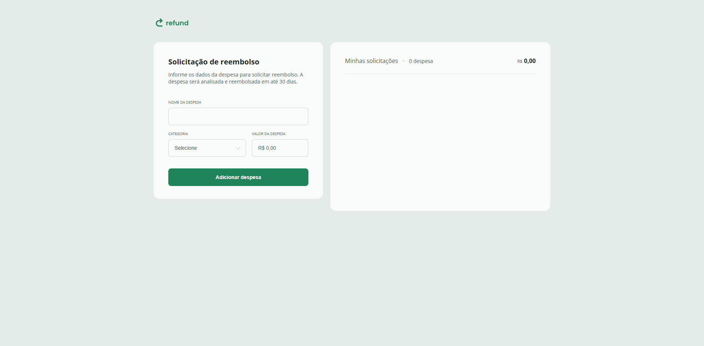

# 💸 Refund

Projeto de estudos desenvolvido durante a trilha da Rocketseat. O objetivo é simular uma tela de controle de gastos com funcionalidades básicas de adicionar e remover despesas.

## 🚀 Tecnologias

Este projeto foi desenvolvido com as seguintes tecnologias:

- HTML
- CSS
- JavaScript

## 💻 Funcionalidades

- Adicionar uma nova despesa com nome, valor e categoria
- Remover despesas da lista
- Cálculo automático do total de gastos
- Interface responsiva

## 📷 Preview



> *Adicione uma imagem do projeto se quiser. Para isso, tire um print e salve como `screenshot.png` na raiz.*

## 📦 Como rodar o projeto

Clone o repositório:

```bash
git clone https://github.com/dieegomarcelo/refund.git
```

Acesse a pasta do projeto:

```bash
cd refund
```

Abra o `index.html` com seu navegador ou use uma extensão como "Live Server" no VSCode.

## 📝 Licença

Este projeto está sob a licença MIT.  
Feito com 💙 por [@dieegomarcelo](https://github.com/dieegomarcelo)
